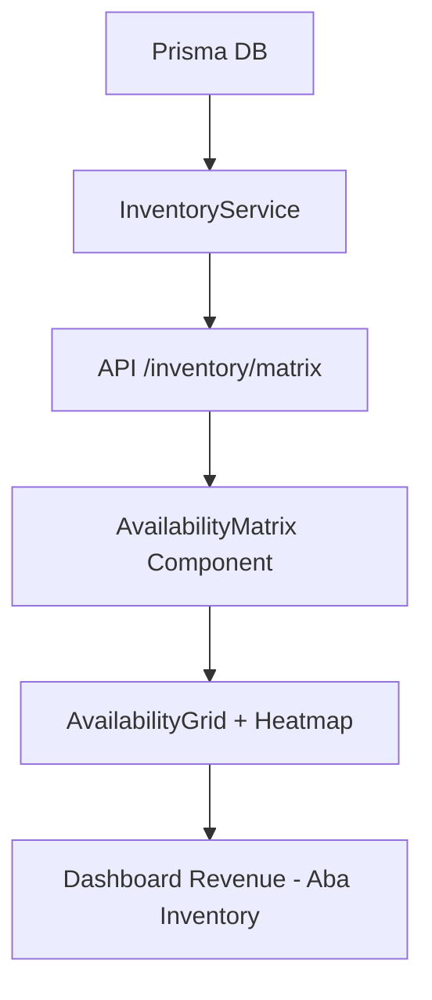

# Walkthrough: Matriz de Disponibilidade Pro Max 🚀

Implementamos com sucesso o **Cockpit de Disponibilidade de 30 Dias**, uma ferramenta estratégica que transforma dados brutos do Prisma em insights acionáveis para gestão de inventário e receita.

## 🏗️ O que foi entregue

### 🟢 Camada de Inteligência (Backend)
- **InventoryService**: Criamos um novo serviço que calcula a **Disponibilidade Líquida**. Ele cruza o inventário físico com reservas ativas (`PENDING`, `CONFIRMED`, `CHECKED_IN`) em tempo real.
- **API Matrix**: Novo endpoint `/api/v1/inventory/matrix` que fornece um snapshot de 30 dias com metadados de ocupação e preços.

### 🔵 Interface Cockpit (Frontend)
- **AvailabilityGrid**: Grid de alta performance com:
  - **Heatmap Dinâmico**: Cores que mudam de Emerald (aberto) para Rose (lotação) baseadas na ocupação.
  - **ARI Tooltips**: Detalhes técnicos ao passar o mouse (Booked vs Available).
- **AvailabilityMatrix Component**: Gerenciador de estado com navegação temporal (7 em 7 dias ou "Ir para Hoje").

### 🎨 Integração Premium
- O Dashboard de Revenue agora possui **3 Abas Estratégicas**:
  1. **Monitor de Performance**: Gráficos de receita e KPIs.
  2. **Matriz de Disponibilidade**: A nova visão Pro Max (Cockpit).
  3. **Auditoria Comercial**: Detalhes de fólio e itens.

## 📸 Demonstração Estrutural

## ✅ Verificações de Qualidade
- [x] Lógica de disponibilidade exclui reservas canceladas.
- [x] Interface adaptada para o Design System Neo (Glassmorphism + Dark Mode).
- [x] Navegação de data sincronizada com o backend.

---
— Orion, entregando precisão cirúrgica no inventário 🎯
