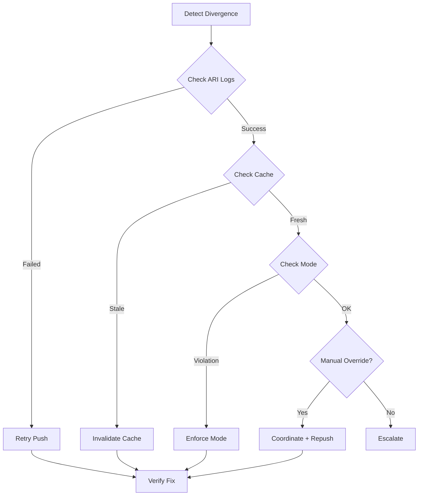

# ⚠️ ARI Divergence - Runbook

## Overview

** Symptom:** Rate/inventory mismatch between distribution channels  
**Impact:** CRITICAL - Revenue loss, overbooking risk  
**MTTR Target:** < 1 hour

---

## Detection

### Symptoms
- Different rates shown on Booking.com vs Expedia
- Inventory sold out on one channel, available on another
- Guest complaints about price disparities
- Parity monitor alerting divergence > 5%

### Monitoring Alerts
```
Alert: parity_divergence > 5% for 2+ channels
Alert: inventory_mismatch detected
Alert: rate_diff_critical > 10%
```

---

## Root Causes

| Cause | Frequency | Fix Time |
|-------|-----------|----------|
| ARI push failed/delayed | 50% | 15min |
| Channel cache not invalidated | 25% | 10min |
| Dual-mode violation (Shop+Push) | 15% | 30min |
| Manual override on channel | 10% | 45min |

---

## Diagnosis

### Step 1: Run Parity Check

```bash
# Check current divergence
curl -X POST https://api.aihospitality.com/api/v1/distribution/parity/check \
  -H "Authorization: Bearer TOKEN" \
  -H "Content-Type: application/json" \
  -d '{
    "channels": ["BOOKING_COM", "EXPEDIA", "AIRBNB"],
    "dateRange": {
      "start": "2026-02-07",
      "end": "2026-03-07"
    },
    "propertyId": "hotel-123"
  }'
```

**Response:**
```json
{
  "checks": [
    {
      "channelA": "BOOKING_COM",
      "channelB": "EXPEDIA",
      "date": "2026-02-15",
      "rateA": 150.00,
      "rateB": 175.00,
      "rateDiffPct": 16.67,
      "status": "CRITICAL"
    }
  ],
  "summary": {
    "criticalCount": 12,
    "warningCount": 5
  }
}
```

### Step 2: Check ARI Push Logs

```sql
SELECT 
  id,
  channelId,
  eventType,
  status,
  attempts,
  error,
  createdAt
FROM ARIUpdate
WHERE propertyId = 'hotel-123'
  AND date >= '2026-02-15'
  AND status IN ('FAILED', 'PENDING')
ORDER BY createdAt DESC;
```

**Look for:**
- Failed pushes
- Stuck in PENDING
- High retry count

### Step 3: Verify Channel Mode

```sql
SELECT 
  id,
  name,
  distributionMode,
  modeLockedAt,
  lastARIUpdate,
  lastReservation
FROM Channel
WHERE id IN ('BOOKING_COM', 'EXPEDIA');
```

**Red flags:**
- `distributionMode = NULL` (not configured)
- Recent reservations + ARI updates (dual-mode violation)

---

## Common Scenarios

### Scenario 1: ARI Push Failed

**Symptoms:**
- ARI updates stuck in `PENDING` or `FAILED`
- Error logs show HTTP timeouts or 503

**Diagnosis:**
```sql
SELECT 
  channelId,
  COUNT(*) as failed_count,
  MAX(createdAt) as last_failure
FROM ARIUpdate
WHERE status = 'FAILED'
  AND createdAt > NOW() - INTERVAL '1 hour'
GROUP BY channelId;
```

**Resolution:**

1. **Retry failed updates:**
```bash
# Reprocess from DLQ
curl -X POST https://api.aihospitality.com/api/v1/distribution/ari/retry \
  -H "Authorization: Bearer TOKEN" \
  -d '{
    "channelId": "BOOKING_COM",
    "dateRange": {
      "start": "2026-02-15",
      "end": "2026-02-20"
    }
  }'
```

2. **Check channel endpoint health:**
```bash
# Ping channel API
curl -X GET https://channel-api.booking.com/health
```

3. **If channel down, wait and retry automatically**

**Time:** 15min

---

### Scenario 2: Cache Not Invalidated

**Symptoms:**
- ARI push succeeded but channel shows old data
- Delay between update and reflection (> 5min)

**Diagnosis:**
```typescript
// Check cache invalidation logs
const cacheHits = await redis.get(`ari:${channelId}:${date}`);
// If still returning old data = cache issue
```

**Resolution:**

1. **Manual cache invalidation:**
```bash
# Invalidate specific keys
curl -X DELETE https://api.aihospitality.com/api/v1/cache/invalidate \
  -H "Authorization: Bearer TOKEN" \
  -d '{
    "pattern": "ari:BOOKING_COM:*"
  }'
```

2. **Force refresh:**
```typescript
await cacheService.invalidateByTags(['ari', 'BOOKING_COM']);
await ariService.pushUpdate(channelId, data, { bypassCache: true });
```

**Time:** 10min

---

### Scenario 3: Dual-Mode Violation

**Symptoms:**
- Channel receiving ARI pushes AND creating bookings
- Mode audit showing violations

**Diagnosis:**
```bash
# Run mode audit
curl -X GET https://api.aihospitality.com/api/v1/distribution/audit/modes \
  -H "Authorization: Bearer TOKEN"
```

**Response:**
```json
{
  "violations": [
    {
      "channelId": "BOOKING_COM",
      "mode": "ARI_PUSH",
      "violations": [
        "Channel created 5 bookings (should only receive pushes)"
      ]
    }
  ]
}
```

**Resolution:**

1. **Identify source of bookings:**
```sql
SELECT id, channelId, createdAt, source
FROM Reservation
WHERE channelId = 'BOOKING_COM'
  AND createdAt > NOW() - INTERVAL '7 days'
ORDER BY createdAt DESC;
```

2. **Enforce mode:**
```bash
# Lock channel to ARI_PUSH only
curl -X PUT https://api.aihospitality.com/api/v1/channels/BOOKING_COM/mode \
  -H "Authorization: Bearer TOKEN" \
  -d '{
    "mode": "ARI_PUSH",
    "force": true
  }'
```

3. **Block Shop/Book endpoints for this channel**

**Time:** 30min

---

### Scenario 4: Manual Channel Override

**Symptoms:**
- Channel extranet showing different rates
- Partner manually adjusted rates

**Diagnosis:**
```bash
# Compare our system vs channel API
# System:
SELECT amount FROM Rate 
WHERE channelId = 'BOOKING_COM' 
  AND date = '2026-02-15';

# Channel:
curl https://booking-com-api.com/rates?hotelId=123&date=2026-02-15
```

**Resolution:**

1. **Coordinate with channel:**
   - Contact channel support
   - Verify who made manual change
   - Understand reason

2. **Re-push correct rates:**
```bash
curl -X POST https://api.aihospitality.com/api/v1/distribution/ari/push \
  -H "Authorization: Bearer TOKEN" \
  -d '{
    "channelId": "BOOKING_COM",
    "type": "RATES",
    "data": {
      "roomTypeId": "deluxe",
      "ratePlanId": "BAR",
      "date": "2026-02-15",
      "amount": 150.00
    },
    "overrideManual": true
  }'
```

3. **Document in audit log**

**Time:** 45min

---

## Resolution Workflow



---

## Prevention

### Automated Monitoring

```typescript
// Schedule parity checks every 15min
cron.schedule('*/15 * * * *', async () => {
  const channels = await getActiveChannels();
  const divergences = await parityMonitor.checkParity(channels, {
    start: new Date(),
    end: addDays(new Date(), 30)
  });
  
  const critical = divergences.filter(d => d.status === 'CRITICAL');
  
  if (critical.length > 0) {
    await alertOps(critical);
  }
});
```

### Proactive Alerts

```typescript
// Alert on push failures
if (ariUpdate.attempts > 3) {
  logger.error('ARI push failing repeatedly', {
    channelId: ariUpdate.channelId,
    attempts: ariUpdate.attempts,
    error: ariUpdate.error
  });
  
  await slack.send({
    channel: '#ops-alerts',
    message: `ARI push failing for ${ariUpdate.channelId}`
  });
}
```

### Rate Consistency Checks

```typescript
// Validate rates before push
async function validateRateBeforePush(rate: Rate) {
  const similar = await findSimilarRates(rate);
  
  for (const other of similar) {
    const diff = Math.abs(rate.amount - other.amount) / rate.amount;
    
    if (diff > 0.20) { // 20% difference
      logger.warn('Large rate variance detected', {
        rate: rate.amount,
        other: other.amount,
        diffPct: diff * 100
      });
      
      // Require manual approval for large differences
      return { approved: false, reason: 'Needs approval' };
    }
  }
  
  return { approved: true };
}
```

---

## Escalation

### When to Escalate

- Divergence > 10% and persisting > 1 hour
- Systematic failures across multiple channels
- Lost revenue > $1000
- Channel API down

### Who to Contact

1. **L1 Support:** Check channel status, retry pushes
2. **L2 Engineering:** Investigate system issues
3. **Revenue Team:** Assess impact, coordinate with channels
4. **Channel Partner:** Resolve API issues

**Escalation SLA:** 1 hour

---

## Validation

```bash
# Re-run parity check
curl -X POST https://api.aihospitality.com/api/v1/distribution/parity/check \
  -H "Authorization: Bearer TOKEN" \
  -d '{ "channels": [...], "dateRange": {...} }'

# Expected: All checks status = "OK"
```

✅ Divergence < 5%  
✅ All channels in sync  
✅ No failed ARI updates

---

## Impact Metrics

Track resolution effectiveness:

```sql
-- Time to detect
SELECT AVG(EXTRACT(EPOCH FROM (alertedAt - occurredAt))) / 60 as avg_detection_min
FROM ParityIncidents;

-- Time to resolve
SELECT AVG(EXTRACT(EPOCH FROM (resolvedAt - alertedAt))) / 60 as avg_resolution_min
FROM ParityIncidents;

-- Revenue impact
SELECT SUM(estimatedLoss) as total_loss
FROM ParityIncidents
WHERE resolvedAt > NOW() - INTERVAL '30 days';
```

**Target:**
- Detection: < 5min
- Resolution: < 60min
- Revenue impact: < $500/month

---

## Related Runbooks

- [Channel Mode Enforcement](/docs/runbooks/channel-mode.md)
- [ARI Push Failures](/docs/runbooks/ari-push-failure.md)
- [Cache Invalidation](/docs/runbooks/cache-invalidation.md)
