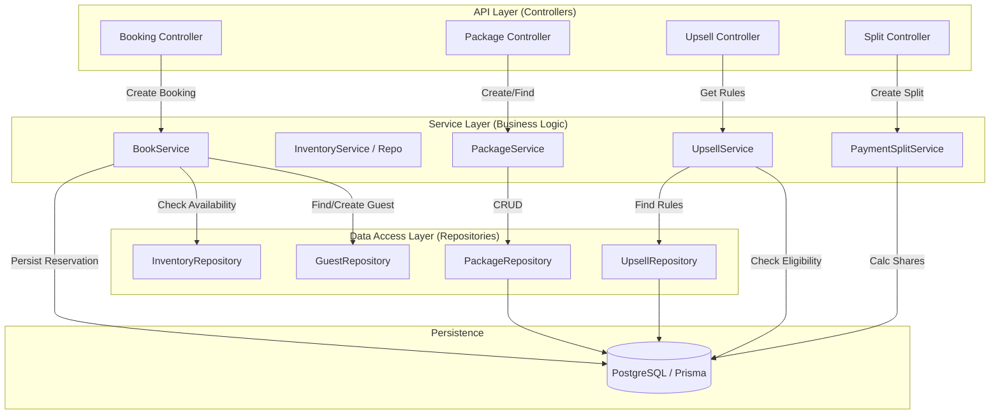

# Arquitetura do Sistema - Módulo de Hospitalidade e Monetização

## Visão Geral
Este documento descreve a arquitetura dos serviços principais de hospitalidade (Reservas, Inventário) e as novas camadas de monetização (Pacotes, Upsell, Split de Pagamento).

## Diagrama de Componentes (Saga de Reservas e Monetização)

A arquitetura segue o padrão de **Camadas (Layered Architecture)** e **Repositório**, garantindo desacoplamento entre regras de negócio e persistência.

## Architectural Decision Records (ADR)

### ADR-001: Adoção do Padrão Repository

**Status**: Aceito e Implementado (Fase Monetização)

**Contexto**:
Anteriormente, os serviços (`Service Layer`) acessavam o `Prisma Client` diretamente. Isso criava um alto acoplamento, dificultava testes unitários (mocking complexo do Prisma) e espalhava queries SQL-like por toda a regra de negócio.

**Decisão**:
Adotar o padrão **Repository** para todos os novos módulos de Monetização (`Packages`, `Upsell`) e refatorar módulos críticos existentes (`Identity/Guest`, `Inventory/Restrictions`).

**Consequências**:
- **Positivas**:
    - **Testabilidade**: Repositórios podem ser facilmente mockados em testes unitários.
    - **Manutenibilidade**: Mudanças no schema do banco ou ORM ficam confinadas ao repositório.
    - **Clareza**: Serviços focam apenas em regras de negócio (cálculos, validações), não em como buscar dados.
- **Negativas**:
    - Aumento no número de arquivos (classes Repository adicionais).
    - Necessidade de boilerplate para métodos CRUD simples.

### ADR-002: Centralização de Schemas (Zod)

**Status**: Aceito

**Contexto**:
Validações de entrada estavam dispersas nos Controllers (`route.ts`).

**Decisão**:
Centralizar todos os schemas de validação `Zod` em `src/lib/schemas`.

**Benefícios**:
- Reuso de schemas entre Backend e Frontend (futuro).
- Controllers mais limpos, focados apenas em HTTP.

---
*Gerado via Skill: code-documentation-doc-generate*
